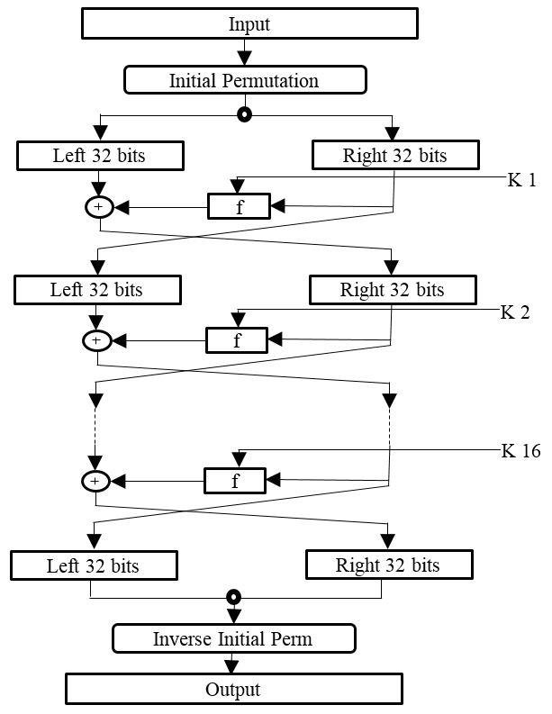
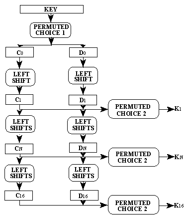
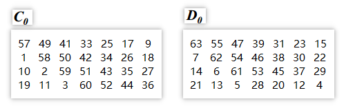
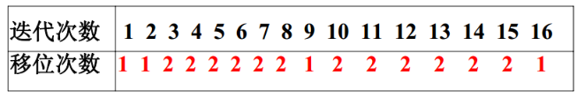
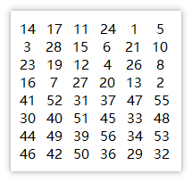
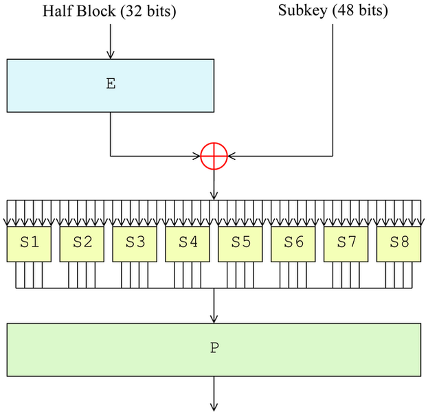
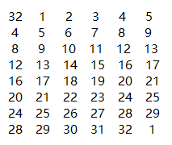
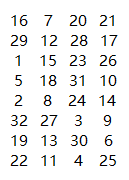

## 一. DES概述

数据加密标准（Data Encryption Standard），一种使用密钥加密的块算法，1977年被美国联邦政府的国家标准局确定为联邦资料处理标准（FIPS），并授权在非密级政府通信中使用，随后该算法在国际上广泛流传开来。需要注意的是，在某些文献中，作为算法的DES称为数据加密算法（Data Encryption Algorithm,DEA），已与作为标准的DES区分开来。

### 1. 几个重要的历史时间

- 1973年美国国家标准局（NBS）向社会公开征集加 密算法，以制定加密算法标准； 
- 1974年第二次征集； 
- 1975年选中IBM的算法，并公布征求意见； 
- 1977年1月15日正式颁布； 
- 1998年底以后停用； 
- 1999年颁布3DES为新标准。 

### 2. 标准加密算法的目标

- 用于加密保护政府机构和商业部门的非机密的敏感 数据。
- 用于加密保护静态存储和传输信道中的数据。
- 安全使用10 ~ 15年。    

### 3.密码的整体特点

- 分组密码，明文、密文和密钥的分组长度都是64位。
- 面向二进制的密码算法，因而能够加解密任何形式的计算机数据。 
- 对合运算:    
  - f = f^-1
  - 加密和解密共用同一算法，使工程实现的工作量减半。    
- 综合运用了置换、代替、代数等基本密码技术。 
- 基本结构属于Feistel结构。    

### 4. 应用

- 在全世界范围得到广泛应用。 
- 许多国际组织采用为标准。 
- 产品形式：软件（嵌入式，应用软件） 硬件（芯片，插卡）

### 5. 结论

- 用于其设计目标是安全的。 
- 设计精巧、实现容易、使用方便，堪称典范。 
- 为国际信息安全发挥了重要作用。   


## 二. 加密过程

- 64位密钥经子密钥产生算法产生出16个子密钥： K1, K2, ..., K16 ， 分别供第一次, 第二次, ..., 第十六次加密迭代使用。
- 64位明文经初始置换IP， 将数据打乱重排并分成左右两半。左边32位构成L0 ， 右边2位构成R0 。 
- 第一次加密迭代：由加密函数f实现子密钥k1对R0的加密，得到32位的f(R0, K1)，然后L0⊕f(R0, K1)，32位的结果作为第二次加密迭代的R1，以R0作为第二次加密迭代的L1。    
- 第二次加密迭代至第十六次加密迭代分别用子密钥K2 ,..., K16进行，其过程与第一次加密迭代相同。 
- 第十六次加密迭代结束后，产生一个64位的数据组，以其左边32位作为R16， 以其右边32位作为L16 。
- R16与L16合并，再经过逆初始置换IP ^–1， 将数据重新排列，便得到64位密文。    

​                    


### 1. 子密钥的产生

64位密钥经过置换选择1、循环左移、置换选择2等变换，产生16个子密钥 K1，K2。… K16，分别供各次加密迭代使用。 

​                                            


#### ( 1 ). 置换选择1  (Permuted Choice 1)

64位的密钥分为8字节，每个字节的第八位是奇偶校验位，前七位才是真正的密钥位。奇偶校验位用于密钥检错，确保其完整性；它不是随机的，可由前七位密钥位算得。因此，DES真正的密钥只有56位。

置换选择1的作用：

- 去掉密钥中的8个奇偶校验位。 
- 把其余的56位打乱重排，将前28位作为C0， 后28位作为D0 。    

置换规则：C0的各位依次为原密钥的第57, 49, ..., 1, ..., 44, 36位；D0的各位依次为原密钥的第63, 55, ..., 7, ..., 12, 4位。

​                                    

​                 

#### ( 2 ). 循环左移 （Left Shift）

对Ci ， Di分别循环左移n位，其中n是会随着迭代次数变化的，其与迭代次数映射表如下所示

​               


#### ( 3 ). 置换选择2 （Permuted Choice 2）

64位的密钥分成32位的两份，进过置换选择后各成为28位的数据（即C0和D0），就是说Ci和Di都是28位的数据。将Ci和Di合并成一个56位的数据，置换选择2从中选出一个48位的子密钥Ki。规定子密钥Ki的56位依次是该56位中间数据的第14, 17, ..., 5, 3, ..., 29, 32位，其置换表如下所示

​                                                                


#### ( 4 ). 代码实现

为了方便理清生成子密钥的逻辑，其中的打印输出的代码并没有给出，完整源码见该项目Github仓库

```java
/**
 * 生成16个48位的子密钥
 * @param keyBytes 64位原密钥，用字符数组存储其比特串
 * @return 子密钥数组，用二维字符数组表示
 */
private char[][] generateSubKeys(char[] keyBytes) {
    char[][] subKeys = new char[16][48];
    // 置换选择 1
    char[] c = ArrayUtil.disruptArray(keyBytes, DESConstants.replace1C);
    char[] d = ArrayUtil.disruptArray(keyBytes, DESConstants.replace1D);

    // 循环左移
    for (int i = 0; i < 16; i++) {
        c = ArrayUtil.leftShift(c, DESConstants.moveBit[i]);
        d = ArrayUtil.leftShift(d, DESConstants.moveBit[i]);
        
        // 将Ci和Di合并得到56位的中间数据
        char[] concatChars = ArrayUtil.concat(c, d);

        // 置换选择 2，得到48位的子密钥Ki
        char[] key = ArrayUtil.disruptArray(concatChars, DESConstants.replace2);
        subKeys[i] = key;
    }
    return subKeys;
}
```


### 2. 初始置换IP

初始置换是DES算法的第一步密码变换，它的作用是将64位的明文打乱重排，并分成左右两半。左边32位作为L0，右边32位作为R0，供后面迭代使用。规定置换后的64位数据的各位依次是原明文数据的第58, 50, ..., 2, 60, ..., 15, 7位，其置换表如下所示

​                                                        


### 3. 加密函数

加密函数是DES的核心，它的租用是在第i次迭代中用子密钥Ki对R(i-1)进行加密。其运行规则是：在第i次迭代加密中选择运算E对32位的R(i-1)的各位进行选择排列，产生48位的结果，此结果与48位的子密钥进行异或运算，然后送入替代函数组S。S由8个替代函数（替代盒，Substitute Box）组成，每个S盒有6位输入和4位输出。8个S盒的输出合并得到一个32位的数组，此数据组经过置换运算P，将各位打乱重排，得到的结果便是加密函数的返回值f(R(i-1), Ki)。

​                  


#### 1. 选择运算 E

该过程对32位的数据组Half Block的各位进行选择和排列，产生一个48位的结果，可见该运算是一个扩展运算，它将32位的数据扩展成了48位的数据，以便与48位的子密钥进行异或运算，下面是选择运算的运算矩阵，可见它是通过重复选择某些数据位来达到数据扩展的目的的。

​                                                         


#### 2. 替代函数组 S

由8个S盒（S1, S2, S3, S4, S5, S6, S7, S8）组成，S的输入是一个48位的数据，从1到48位依次加到8个S盒的输入端。每个S盒有一个替代矩阵，规定了其输入输出的替代规则。替代矩阵有4行16列，每行都是0到15这16个数字，但每行数字的排列都不同，且8个替代矩阵彼此不同。每个S盒有6位输入，4位输出，S盒的运算结果是用输出数据替代输入数据，故称为替代函数。

S盒的替代规则为：6位输入的第1位和第6位组成二进制数b1b6代表对应矩阵中被选中的行号，其余四位数字b2b3b4b5组成的二进制数代表对应矩阵中被选中的列号。以S1为例，假设输入数据为b1b2b3b4b5b6 = 101011，则第1位和第6位组成二进制数b1b6 = 11 = 3，表示选中行号为3的那行；b2b3b4b5 = 0101 = 5，表示选中列号为5的那列，行列交点为9，则S1的输出为1001。替代函数组 S中各S盒矩阵如下所示

​                             


#### 3. 置换运算 P

该过程是把S盒输出的32位数据打乱重排，得到32位的加密函数输出，用P置换来扩散，将S盒的混淆租用扩散开来，正是置换P与S盒的互相配合提高了DES的安全性，置换矩阵P如下所示

​                                                                           

#### 4. 代码实现

```java
/**
 * DES核心加密函数
 * 包括扩展、替代、选择等操作
 * @param right R(i-1)
 * @param subKey Ki
 * @return result 运算结果
 */
private char[] coreEncrypt(char[] right, char[] subKey) {
    // 1. 选择运算 E
    char[] extendedRight = ArrayUtil.disruptArray(right, DESConstants.E);
	
    // 2. 将晋国选择运算E扩展得到的48位的数据与子密钥进行异或
    char[] xorResult = ArrayUtil.xor(extendedRight, subKey);

    // 3. 用替代函数组进行替代
    // 为便于处理，将上述1x48位的数据矩阵转换成8x6的数据矩阵
    char[][] twoDimensionArray = ArrayUtil.segmentDimension(xorResult, 8, 6);
    StringBuilder outputBuilder = new StringBuilder();
    // 根据替代规则进行替代
    for (int i = 0; i < twoDimensionArray.length; i++) {
        char[] rowBits = {twoDimensionArray[i][0], twoDimensionArray[i][5]};
        char[] columnBits =
        {
            twoDimensionArray[i][1], twoDimensionArray[i][2],
            twoDimensionArray[i][3], twoDimensionArray[i][4]
        };

        // 获取对应S盒的输出的坐标
        int rowIndex = Integer.parseInt(String.valueOf(rowBits), 2);
        int columnIndex = Integer.parseInt(String.valueOf(columnBits), 2);
		// 获取对应S盒的输出
        short output = DESConstants.SUBSTITUTE_BOX[i][rowIndex][columnIndex];
        outputBuilder.append(Integer.toBinaryString((output & 0x0f) + 0x10).substring(1));
    }
    char[] substitutedResult = outputBuilder.toString().toCharArray();
    // 4. 进行置换运算 P，返回28位的数据
    return ArrayUtil.disruptArray(substitutedResult, DESConstants.P);
}
```


### 4. 整个加密过程

回顾DES的总体加密过程

- 64位密钥经子密钥产生算法产生出16个子密钥： K1, K2, ..., K16 ， 分别供第一次, 第二次, ..., 第十六次加密迭代使用。
- 64位明文经初始置换IP， 将数据打乱重排并分成左右两半。左边32位构成L0 ， 右边2位构成R0 。 
- 第一次加密迭代：由加密函数f实现子密钥k1对R0的加密，得到32位的f(R0, K1)，然后L0⊕f(R0, K1)，32位的结果作为第二次加密迭代的R1，以R0作为第二次加密迭代的L1。    
- 第二次加密迭代至第十六次加密迭代分别用子密钥K2 ,..., K16进行，其过程与第一次加密迭代相同。 
- 第十六次加密迭代结束后，产生一个64位的数据组，以其左边32位作为R16， 以其右边32位作为L16 。
- R16与L16合并，再经过逆初始置换IP ^–1， 将数据重新排列，便得到64位密文。    

上面我们已经进行了子密钥的生成、初始置换和核心加密函数，接下来是进行中Li⊕f(R(i-1), Ki)以及确定下一趟迭代的L和R。在16次迭代完之后再进行逆初始置换就可以得到加密的64位结果。

​                    

整体的加密过程函数

```java
/**
 * 对外的加密接口，主要逻辑封装在encode方法中
 * @param plaintext 明文
 * @param key 密钥
 * @return encrypted text
 * @throws UnsupportedEncodingException caused by String.getBytes()
 */
public String encrypt(String plaintext, String key) throws UnsupportedEncodingException {
    // 获取明文及密钥对应的比特串，用字符数组存储
    char[] plaintextBytes = ArrayUtil.bytesToChars(
        plaintext.getBytes("UTF-8"));
    char[] keyBytes = ArrayUtil.bytesToChars(
        key.getBytes("UTF-8"));
	// 子密钥的生成
    char[][] subKeys = generateSubKeys(keyBytes);
    char[] result = encode(plaintextBytes, subKeys);
	// 使用Base64编码对不可见及非打印字符进行编码
    return Base64Util.encode(result);
}

/**
 * 主体加密逻辑
 * @param plaintextBytes 用字符数组存放的明文的比特串
 * @param subKeys 子密钥数组
 * @return encryption 64位加密结果
 */
private char[] encode(char[] plaintextBytes, char[][] subKeys) {
    // 初始置换 IP
    char[] chars = ArrayUtil.disruptArray(plaintextBytes, DESConstants.IP);

    // 将明文分成两半
    int length = chars.length;
    String binaryArrayStr = String.valueOf(chars);
    char[] left = binaryArrayStr.substring(0, length / 2).toCharArray();
    char[] right = binaryArrayStr.substring(length / 2).toCharArray();
    char[] coreEncrypted, xorResult;

    for (int i = 0; i < 16; i++) {
        // 调用核心加密函数，用子密钥Ki对R(i-1)进行加密，得到28位数据
        coreEncrypted = coreEncrypt(right, subKeys[i]);

        // L(i - 1)与f(R(i - 1), Ki)进行异或运算
        xorResult = String.valueOf(ArrayUtil.xor(left, coreEncrypted))
           					 .substring(16).toCharArray();

        left = right;
        right = xorResult;
    }
    char[] calResult = ArrayUtil.concat(right, left);
    // 逆初始置换
    return ArrayUtil.disruptArray(calResult, DESConstants.inverseIP);
}
```


## 三. 解密过程

通过数学推理可证明DES具有可逆性和对合性的（限于蝙蝠，在此不作证明），即加密和解密可共用同一个运算，只是子密钥的使用顺序调转而已，即第一次解密迭代使用子密钥K16，第十六次解密迭代使用子密钥K1。

#### 代码实现

基于上述的思想，我们可以将通过密钥获取到的子密钥数组逆转，然后调用encode方法即可

```java
/**
 * 解密
 * @param encryptedText 加密数据
 * @param key  密钥
 * @return decrypted origin plaintext
 * @throws UnsupportedEncodingException caused by String.getBytes()
 */
@Override
public String decrypt(String encryptedText, String key) throws UnsupportedEncodingException {
    // 将已使用Base64编码的密文解码
    char[] encryptedTextBytes = Base64Util.decode(encryptedText);
    char[] keyBytes = ArrayUtil.bytesToChars(
        key.getBytes("UTF-8"));
	
    // 将通过密钥获取到的子密钥数组逆转
    char[][] inverseKeys = inverseSubKeys(generateSubKeys(keyBytes));
    // 解密
    char[] result = encode(encryptedTextBytes, inverseKeys);
    // 将比特串还原为字符串明文
    return ArrayUtil.segmentAndPrintChars("decrypt plaintext text", result);
}

/**
 * 将通过密钥获取到的子密钥数组逆转
 * @param subKeys 原子密钥数组
 * @return  翻转的子密钥数组
 */ 
private char[][] inverseSubKeys(char[][] subKeys) {
    char[][] inverseKeys = new char[subKeys.length][];

    for (int i = 0; i < subKeys.length; i++) {
        inverseKeys[i] = subKeys[subKeys.length - 1 - i];
    }
    return inverseKeys;
}
```


## 四. 测试

### 1. 测试代码

使用Junit进行单元测试

```java
@Test
public void testService() {
    String plaintext = "01234567", key = "12345678";
    CipherService cipherService = new DESCipherService();
    try {
        String encryptedText = cipherService.encrypt(plaintext, key);
        cipherService.decrypt(encryptedText,key);
    } catch (UnsupportedEncodingException e) {
        e.printStackTrace();
    }
}
```

### 2. 加密过程

```
plaintext                     01234567                      
keyText                       12345678                      

plaintext bits                00110000 00110001 00110010 00110011 00110100 00110101 00110110 00110111 
key bits                      00110001 00110010 00110011 00110100 00110101 00110110 00110111 00111000 
Permuted Choice 1 C0          00000000 00000000 11111111 1111 
Permuted Choice 1 D0          01100110 01111000 10000000 1111 

Start to generate sub keys......
[1] leftShifting C            00000000 00000001 11111111 1110 
[1] leftShifting D            11001100 11110001 00000001 1110 
[1] concatChars               00000000 00000001 11111111 11101100 11001111 00010000 00011110 
[1] subKey                    01010000 00101100 10101100 01010111 00101010 11000010 

[2] leftShifting C            00000000 00000011 11111111 1100 
[2] leftShifting D            10011001 11100010 00000011 1101 
[2] concatChars               00000000 00000011 11111111 11001001 10011110 00100000 00111101 
[2] subKey                    01010000 10101100 10100100 01010000 10100011 01000111 

[3] leftShifting C            00000000 00001111 11111111 0000 
[3] leftShifting D            01100111 10001000 00001111 0110 
[3] concatChars               00000000 00001111 11111111 00000110 01111000 10000000 11110110 
[3] subKey                    11010000 10101100 00100110 11110110 10000100 10001100 

[4] leftShifting C            00000000 00111111 11111100 0000 
[4] leftShifting D            10011110 00100000 00111101 1001 
[4] concatChars               00000000 00111111 11111100 00001001 11100010 00000011 11011001 
[4] subKey                    11100000 10100110 00100110 01001000 00110111 11001011 

[5] leftShifting C            00000000 11111111 11110000 0000 
[5] leftShifting D            01111000 10000000 11110110 0110 
[5] concatChars               00000000 11111111 11110000 00000111 10001000 00001111 01100110 
[5] subKey                    11100000 10010110 00100110 00111110 11110000 00101001 

[6] leftShifting C            00000011 11111111 11000000 0000 
[6] leftShifting D            11100010 00000011 11011001 1001 
[6] concatChars               00000011 11111111 11000000 00001110 00100000 00111101 10011001 
[6] subKey                    11100000 10010010 01110010 01100010 01011101 01100010 

[7] leftShifting C            00001111 11111111 00000000 0000 
[7] leftShifting D            10001000 00001111 01100110 0111 
[7] concatChars               00001111 11111111 00000000 00001000 10000000 11110110 01100111 
[7] subKey                    10100100 11010010 01110010 10001100 10101001 00111010 

[8] leftShifting C            00111111 11111100 00000000 0000 
[8] leftShifting D            00100000 00111101 10011001 1110 
[8] concatChars               00111111 11111100 00000000 00000010 00000011 11011001 10011110 
[8] subKey                    10100110 01010011 01010010 11100101 01011110 01010000 

[9] leftShifting C            01111111 11111000 00000000 0000 
[9] leftShifting D            01000000 01111011 00110011 1100 
[9] concatChars               01111111 11111000 00000000 00000100 00000111 10110011 00111100 
[9] subKey                    00100110 01010011 01010011 11001011 10011010 01000000 

[10] leftShifting C           11111111 11100000 00000000 0001 
[10] leftShifting D           00000001 11101100 11001111 0001 
[10] concatChars              11111111 11100000 00000000 00010000 00011110 11001100 11110001 
[10] subKey                   00101111 01010001 01010001 11010000 11000111 00111100 

[11] leftShifting C           11111111 10000000 00000000 0111 
[11] leftShifting D           00000111 10110011 00111100 0100 
[11] concatChars              11111111 10000000 00000000 01110000 01111011 00110011 11000100 
[11] subKey                   00001111 01000001 11011001 00011001 00011110 10001100 

[12] leftShifting C           11111110 00000000 00000001 1111 
[12] leftShifting D           00011110 11001100 11110001 0000 
[12] concatChars              11111110 00000000 00000001 11110001 11101100 11001111 00010000 
[12] subKey                   00011111 01000001 10011001 11011000 01110000 10110001 

[13] leftShifting C           11111000 00000000 00000111 1111 
[13] leftShifting D           01111011 00110011 11000100 0000 
[13] concatChars              11111000 00000000 00000111 11110111 10110011 00111100 01000000 
[13] subKey                   00011111 00001001 10001001 00100011 01101010 00101101 

[14] leftShifting C           11100000 00000000 00011111 1111 
[14] leftShifting D           11101100 11001111 00010000 0001 
[14] concatChars              11100000 00000000 00011111 11111110 11001100 11110001 00000001 
[14] subKey                   00011011 00101000 10001101 10110010 00111001 10010010 

[15] leftShifting C           10000000 00000000 01111111 1111 
[15] leftShifting D           10110011 00111100 01000000 0111 
[15] concatChars              10000000 00000000 01111111 11111011 00110011 11000100 00000111 
[15] subKey                   00011001 00101100 10001100 10100101 00000011 00110111 

[16] leftShifting C           00000000 00000000 11111111 1111 
[16] leftShifting D           01100110 01111000 10000000 1111 
[16] concatChars              00000000 00000000 11111111 11110110 01100111 10001000 00001111 
[16] subKey                   01010001 00101100 10001100 10100111 01000011 11000000 

plaintext after ip            00000000 11111111 11110000 10101010 00000000 11111111 00000000 11001100 
L0                            00000000 11111111 11110000 10101010 
R0                            00000000 11111111 00000000 11001100 

[f] 32-bit input              00000000 11111111 00000000 11001100 
[f] Selection                 00000000 00010111 11111110 10000000 00010110 01011000 
[f] subKey                    01010000 00101100 10101100 01010111 00101010 11000010 
[f] xor                       01010000 00111011 01010010 11010111 00111100 10011010 
[F] SBox                      01101101 10000010 00001110 11110000 
[f] P Replacement             00010010 01111000 11000111 00011001 
[1] left                      00000000 11111111 00000000 11001100 
[1] right                     00010010 10000111 00110111 10110011 

[f] 32-bit input              00010010 10000111 00110111 10110011 
[f] Selection                 10001010 01010100 00001110 10011010 11111101 10100110 
[f] subKey                    01010000 10101100 10100100 01010000 10100011 01000111 
[f] xor                       11011010 11111000 10101010 11001010 01011110 11100001 
[F] SBox                      01110010 01101011 10010010 00100010 
[f] P Replacement             11100001 01100011 10000110 01000110 
[2] left                      00010010 10000111 00110111 10110011 
[2] right                     11100001 10011100 10000110 10001010 

[f] 32-bit input              11100001 10011100 10000110 10001010 
[f] Selection                 01110000 00111100 11111001 01000000 11010100 01010101 
[f] subKey                    11010000 10101100 00100110 11110110 10000100 10001100 
[f] xor                       10100000 10010000 11011111 10110110 01010000 11011001 
[F] SBox                      11011111 01111001 00100010 00000000 
[f] P Replacement             11000100 10101001 11000000 11010110 
[3] left                      11100001 10011100 10000110 10001010 
[3] right                     11010110 00101110 11110111 01100101 

[f] 32-bit input              11010110 00101110 11110111 01100101 
[f] Selection                 11101010 11000001 01011101 01111010 11101011 00001011 
[f] subKey                    11100000 10100110 00100110 01001000 00110111 11001011 
[f] xor                       00001010 01100111 01111011 00110010 11011100 11000000 
[F] SBox                      01001011 11110111 10111111 01011101 
[f] P Replacement             11111111 01111001 11111001 10101100 
[4] left                      11010110 00101110 11110111 01100101 
[4] right                     00011110 11100101 01111111 00100110 

[f] 32-bit input              00011110 11100101 01111111 00100110 
[f] Selection                 00001111 11010111 00001010 10111111 11101001 00001100 
[f] subKey                    11100000 10010110 00100110 00111110 11110000 00101001 
[f] xor                       11101111 01000001 00101100 10000001 00011001 00100101 
[F] SBox                      00001100 10010111 01000110 10111110 
[f] P Replacement             10001110 01101110 00010101 00111001 
[5] left                      00011110 11100101 01111111 00100110 
[5] right                     01011000 01000000 11100010 01011100 

[f] 32-bit input              01011000 01000000 11100010 01011100 
[f] Selection                 00101111 00000010 00000001 01110000 01000010 11111000 
[f] subKey                    11100000 10010010 01110010 01100010 01011101 01100010 
[f] xor                       11001111 10010000 01110011 00010010 00011111 10011010 
[F] SBox                      10110000 11010100 01000100 00100000 
[f] P Replacement             00000100 10000101 00010111 00001010 
[6] left                      01011000 01000000 11100010 01011100 
[6] right                     00011010 01100000 01101000 00101100 

[f] 32-bit input              00011010 01100000 01101000 00101100 
[f] Selection                 00001111 01000011 00000000 00110101 00000001 01011000 
[f] subKey                    10100100 11010010 01110010 10001100 10101001 00111010 
[f] xor                       10101011 10010001 01110010 10111001 10101000 01100010 
[F] SBox                      01100000 00000001 10000111 01101011 
[f] P Replacement             10001001 00110010 10101110 00001000 
[7] left                      00011010 01100000 01101000 00101100 
[7] right                     11010001 01110010 01001100 01010100 

[f] 32-bit input              11010001 01110010 01001100 01010100 
[f] Selection                 01101010 00101011 10100100 00100101 10000010 10101001 
[f] subKey                    10100110 01010011 01010010 11100101 01011110 01010000 
[f] xor                       11001100 01111000 11110110 11000000 11011100 11111001 
[F] SBox                      10110111 10101110 11111001 01010011 
[f] P Replacement             01110011 11010110 01111011 11010110 
[8] left                      11010001 01110010 01001100 01010100 
[8] right                     01101001 10110110 00010011 11111010 

[f] 32-bit input              01101001 10110110 00010011 11111010 
[f] Selection                 00110101 00111101 10101100 00001010 01111111 11110100 
[f] subKey                    00100110 01010011 01010011 11001011 10011010 01000000 
[f] xor                       00010011 01101110 11111111 11000001 11100101 10110100 
[F] SBox                      11010110 01011110 11111011 01111010 
[f] P Replacement             01111111 11110111 10110100 11010010 
[9] left                      01101001 10110110 00010011 11111010 
[9] right                     10101110 10000101 11111000 10000110 

[f] 32-bit input              10101110 10000101 11111000 10000110 
[f] Selection                 01010101 11010100 00001011 11111111 00010100 00001101 
[f] subKey                    00101111 01010001 01010001 11010000 11000111 00111100 
[f] xor                       01111010 10000101 01011010 00101111 11010011 00110001 
[F] SBox                      01111010 01011100 01111000 10001111 
[f] P Replacement             01111100 00001111 10011010 11100011 
[10] left                     10101110 10000101 11111000 10000110 
[10] right                    00010101 10111001 10001001 00011001 

[f] 32-bit input              00010101 10111001 10001001 00011001 
[f] Selection                 10001010 10111101 11110011 11000101 00101000 11110010 
[f] subKey                    00001111 01000001 11011001 00011001 00011110 10001100 
[f] xor                       10000101 11111100 00101010 11011100 00110110 01111110 
[F] SBox                      11110101 10111011 10011111 00101000 
[f] P Replacement             10111101 11100000 11100111 01011110 
[11] left                     00010101 10111001 10001001 00011001 
[11] right                    00010011 01100101 00011111 11011000 

[f] 32-bit input              00010011 01100101 00011111 11011000 
[f] Selection                 00001010 01101011 00001010 10001111 11111110 11110000 
[f] subKey                    00011111 01000001 10011001 11011000 01110000 10110001 
[f] xor                       00010101 00101010 10010011 01010111 10001110 01000001 
[F] SBox                      01110111 11110111 11110001 11100001 
[f] P Replacement             11100101 01010101 11111111 10010111 
[12] left                     00010011 01100101 00011111 11011000 
[12] right                    11110000 11101100 01110110 10001110 

[f] 32-bit input              11110000 11101100 01110110 10001110 
[f] Selection                 01111010 00010111 01011000 00111010 11010100 01011101 
[f] subKey                    00011111 00001001 10001001 00100011 01101010 00101101 
[f] xor                       01100101 00011110 11010001 00011001 10111110 01110000 
[F] SBox                      10011100 01010100 00011011 11100000 
[f] P Replacement             00110100 10111001 00110100 00010011 
[13] left                     11110000 11101100 01110110 10001110 
[13] right                    00100111 11011100 00101011 11001011 

[f] 32-bit input              00100111 11011100 00101011 11001011 
[f] Selection                 10010000 11111110 11111000 00010101 01111110 01010110 
[f] subKey                    00011011 00101000 10001101 10110010 00111001 10010010 
[f] xor                       10001011 11010110 01110101 10100111 01000111 11000100 
[F] SBox                      00011110 11000101 00010100 01101000 
[f] P Replacement             11101000 00011001 00010101 00011010 
[14] left                     00100111 11011100 00101011 11001011 
[14] right                    00011000 11110101 01100011 10010100 

[f] 32-bit input              00011000 11110101 01100011 10010100 
[f] Selection                 00001111 00010111 10101010 10110000 01111100 10101000 
[f] subKey                    00011001 00101100 10001100 10100101 00000011 00110111 
[f] xor                       00010110 00111011 00100110 00010101 01111111 10011111 
[F] SBox                      01111000 00110000 00101110 00100010 
[f] P Replacement             00010100 00101010 10000110 10001110 
[15] left                     00011000 11110101 01100011 10010100 
[15] right                    00110011 11110110 10101101 01000101 

[f] 32-bit input              00110011 11110110 10101101 01000101 
[f] Selection                 10011010 01111111 10101101 01010101 10101010 00001010 
[f] subKey                    01010001 00101100 10001100 10100111 01000011 11000000 
[f] xor                       11001011 01010011 00100001 11110010 11101001 11001010 
[F] SBox                      11000111 11110011 00000011 10001111 
[f] P Replacement             11001100 11100011 11101001 00110101 
[16] left                     00110011 11110110 10101101 01000101 
[16] right                    11010100 00010110 10001010 10100001 

encryptedText bits            10001011 10110100 01111010 00001100 11110000 10101001 01100010 01101101 
encryptedText                 i7R6DPCpYm0=                  
```

### 3. 解密过程

```
encryptedText                 i7R6DPCpYm0=                  
key                           12345678                      

Permuted Choice 1 C0          00000000 00000000 11111111 1111 
Permuted Choice 1 D0          01100110 01111000 10000000 1111 

Start to generate sub keys......
[1] leftShifting C            00000000 00000001 11111111 1110 
[1] leftShifting D            11001100 11110001 00000001 1110 
[1] concatChars               00000000 00000001 11111111 11101100 11001111 00010000 00011110 
[1] subKey                    01010000 00101100 10101100 01010111 00101010 11000010 

[2] leftShifting C            00000000 00000011 11111111 1100 
[2] leftShifting D            10011001 11100010 00000011 1101 
[2] concatChars               00000000 00000011 11111111 11001001 10011110 00100000 00111101 
[2] subKey                    01010000 10101100 10100100 01010000 10100011 01000111 

[3] leftShifting C            00000000 00001111 11111111 0000 
[3] leftShifting D            01100111 10001000 00001111 0110 
[3] concatChars               00000000 00001111 11111111 00000110 01111000 10000000 11110110 
[3] subKey                    11010000 10101100 00100110 11110110 10000100 10001100 

[4] leftShifting C            00000000 00111111 11111100 0000 
[4] leftShifting D            10011110 00100000 00111101 1001 
[4] concatChars               00000000 00111111 11111100 00001001 11100010 00000011 11011001 
[4] subKey                    11100000 10100110 00100110 01001000 00110111 11001011 

[5] leftShifting C            00000000 11111111 11110000 0000 
[5] leftShifting D            01111000 10000000 11110110 0110 
[5] concatChars               00000000 11111111 11110000 00000111 10001000 00001111 01100110 
[5] subKey                    11100000 10010110 00100110 00111110 11110000 00101001 

[6] leftShifting C            00000011 11111111 11000000 0000 
[6] leftShifting D            11100010 00000011 11011001 1001 
[6] concatChars               00000011 11111111 11000000 00001110 00100000 00111101 10011001 
[6] subKey                    11100000 10010010 01110010 01100010 01011101 01100010 

[7] leftShifting C            00001111 11111111 00000000 0000 
[7] leftShifting D            10001000 00001111 01100110 0111 
[7] concatChars               00001111 11111111 00000000 00001000 10000000 11110110 01100111 
[7] subKey                    10100100 11010010 01110010 10001100 10101001 00111010 

[8] leftShifting C            00111111 11111100 00000000 0000 
[8] leftShifting D            00100000 00111101 10011001 1110 
[8] concatChars               00111111 11111100 00000000 00000010 00000011 11011001 10011110 
[8] subKey                    10100110 01010011 01010010 11100101 01011110 01010000 

[9] leftShifting C            01111111 11111000 00000000 0000 
[9] leftShifting D            01000000 01111011 00110011 1100 
[9] concatChars               01111111 11111000 00000000 00000100 00000111 10110011 00111100 
[9] subKey                    00100110 01010011 01010011 11001011 10011010 01000000 

[10] leftShifting C           11111111 11100000 00000000 0001 
[10] leftShifting D           00000001 11101100 11001111 0001 
[10] concatChars              11111111 11100000 00000000 00010000 00011110 11001100 11110001 
[10] subKey                   00101111 01010001 01010001 11010000 11000111 00111100 

[11] leftShifting C           11111111 10000000 00000000 0111 
[11] leftShifting D           00000111 10110011 00111100 0100 
[11] concatChars              11111111 10000000 00000000 01110000 01111011 00110011 11000100 
[11] subKey                   00001111 01000001 11011001 00011001 00011110 10001100 

[12] leftShifting C           11111110 00000000 00000001 1111 
[12] leftShifting D           00011110 11001100 11110001 0000 
[12] concatChars              11111110 00000000 00000001 11110001 11101100 11001111 00010000 
[12] subKey                   00011111 01000001 10011001 11011000 01110000 10110001 

[13] leftShifting C           11111000 00000000 00000111 1111 
[13] leftShifting D           01111011 00110011 11000100 0000 
[13] concatChars              11111000 00000000 00000111 11110111 10110011 00111100 01000000 
[13] subKey                   00011111 00001001 10001001 00100011 01101010 00101101 

[14] leftShifting C           11100000 00000000 00011111 1111 
[14] leftShifting D           11101100 11001111 00010000 0001 
[14] concatChars              11100000 00000000 00011111 11111110 11001100 11110001 00000001 
[14] subKey                   00011011 00101000 10001101 10110010 00111001 10010010 

[15] leftShifting C           10000000 00000000 01111111 1111 
[15] leftShifting D           10110011 00111100 01000000 0111 
[15] concatChars              10000000 00000000 01111111 11111011 00110011 11000100 00000111 
[15] subKey                   00011001 00101100 10001100 10100101 00000011 00110111 

[16] leftShifting C           00000000 00000000 11111111 1111 
[16] leftShifting D           01100110 01111000 10000000 1111 
[16] concatChars              00000000 00000000 11111111 11110110 01100111 10001000 00001111 
[16] subKey                   01010001 00101100 10001100 10100111 01000011 11000000 

plaintext after ip            11010100 00010110 10001010 10100001 00110011 11110110 10101101 01000101 
L0                            11010100 00010110 10001010 10100001 
R0                            00110011 11110110 10101101 01000101 

[f] 32-bit input              00110011 11110110 10101101 01000101 
[f] Selection                 10011010 01111111 10101101 01010101 10101010 00001010 
[f] subKey                    01010001 00101100 10001100 10100111 01000011 11000000 
[f] xor                       11001011 01010011 00100001 11110010 11101001 11001010 
[F] SBox                      11000111 11110011 00000011 10001111 
[f] P Replacement             11001100 11100011 11101001 00110101 
[1] left                      00110011 11110110 10101101 01000101 
[1] right                     00011000 11110101 01100011 10010100 

[f] 32-bit input              00011000 11110101 01100011 10010100 
[f] Selection                 00001111 00010111 10101010 10110000 01111100 10101000 
[f] subKey                    00011001 00101100 10001100 10100101 00000011 00110111 
[f] xor                       00010110 00111011 00100110 00010101 01111111 10011111 
[F] SBox                      01111000 00110000 00101110 00100010 
[f] P Replacement             00010100 00101010 10000110 10001110 
[2] left                      00011000 11110101 01100011 10010100 
[2] right                     00100111 11011100 00101011 11001011 

[f] 32-bit input              00100111 11011100 00101011 11001011 
[f] Selection                 10010000 11111110 11111000 00010101 01111110 01010110 
[f] subKey                    00011011 00101000 10001101 10110010 00111001 10010010 
[f] xor                       10001011 11010110 01110101 10100111 01000111 11000100 
[F] SBox                      00011110 11000101 00010100 01101000 
[f] P Replacement             11101000 00011001 00010101 00011010 
[3] left                      00100111 11011100 00101011 11001011 
[3] right                     11110000 11101100 01110110 10001110 

[f] 32-bit input              11110000 11101100 01110110 10001110 
[f] Selection                 01111010 00010111 01011000 00111010 11010100 01011101 
[f] subKey                    00011111 00001001 10001001 00100011 01101010 00101101 
[f] xor                       01100101 00011110 11010001 00011001 10111110 01110000 
[F] SBox                      10011100 01010100 00011011 11100000 
[f] P Replacement             00110100 10111001 00110100 00010011 
[4] left                      11110000 11101100 01110110 10001110 
[4] right                     00010011 01100101 00011111 11011000 

[f] 32-bit input              00010011 01100101 00011111 11011000 
[f] Selection                 00001010 01101011 00001010 10001111 11111110 11110000 
[f] subKey                    00011111 01000001 10011001 11011000 01110000 10110001 
[f] xor                       00010101 00101010 10010011 01010111 10001110 01000001 
[F] SBox                      01110111 11110111 11110001 11100001 
[f] P Replacement             11100101 01010101 11111111 10010111 
[5] left                      00010011 01100101 00011111 11011000 
[5] right                     00010101 10111001 10001001 00011001 

[f] 32-bit input              00010101 10111001 10001001 00011001 
[f] Selection                 10001010 10111101 11110011 11000101 00101000 11110010 
[f] subKey                    00001111 01000001 11011001 00011001 00011110 10001100 
[f] xor                       10000101 11111100 00101010 11011100 00110110 01111110 
[F] SBox                      11110101 10111011 10011111 00101000 
[f] P Replacement             10111101 11100000 11100111 01011110 
[6] left                      00010101 10111001 10001001 00011001 
[6] right                     10101110 10000101 11111000 10000110 

[f] 32-bit input              10101110 10000101 11111000 10000110 
[f] Selection                 01010101 11010100 00001011 11111111 00010100 00001101 
[f] subKey                    00101111 01010001 01010001 11010000 11000111 00111100 
[f] xor                       01111010 10000101 01011010 00101111 11010011 00110001 
[F] SBox                      01111010 01011100 01111000 10001111 
[f] P Replacement             01111100 00001111 10011010 11100011 
[7] left                      10101110 10000101 11111000 10000110 
[7] right                     01101001 10110110 00010011 11111010 

[f] 32-bit input              01101001 10110110 00010011 11111010 
[f] Selection                 00110101 00111101 10101100 00001010 01111111 11110100 
[f] subKey                    00100110 01010011 01010011 11001011 10011010 01000000 
[f] xor                       00010011 01101110 11111111 11000001 11100101 10110100 
[F] SBox                      11010110 01011110 11111011 01111010 
[f] P Replacement             01111111 11110111 10110100 11010010 
[8] left                      01101001 10110110 00010011 11111010 
[8] right                     11010001 01110010 01001100 01010100 

[f] 32-bit input              11010001 01110010 01001100 01010100 
[f] Selection                 01101010 00101011 10100100 00100101 10000010 10101001 
[f] subKey                    10100110 01010011 01010010 11100101 01011110 01010000 
[f] xor                       11001100 01111000 11110110 11000000 11011100 11111001 
[F] SBox                      10110111 10101110 11111001 01010011 
[f] P Replacement             01110011 11010110 01111011 11010110 
[9] left                      11010001 01110010 01001100 01010100 
[9] right                     00011010 01100000 01101000 00101100 

[f] 32-bit input              00011010 01100000 01101000 00101100 
[f] Selection                 00001111 01000011 00000000 00110101 00000001 01011000 
[f] subKey                    10100100 11010010 01110010 10001100 10101001 00111010 
[f] xor                       10101011 10010001 01110010 10111001 10101000 01100010 
[F] SBox                      01100000 00000001 10000111 01101011 
[f] P Replacement             10001001 00110010 10101110 00001000 
[10] left                     00011010 01100000 01101000 00101100 
[10] right                    01011000 01000000 11100010 01011100 

[f] 32-bit input              01011000 01000000 11100010 01011100 
[f] Selection                 00101111 00000010 00000001 01110000 01000010 11111000 
[f] subKey                    11100000 10010010 01110010 01100010 01011101 01100010 
[f] xor                       11001111 10010000 01110011 00010010 00011111 10011010 
[F] SBox                      10110000 11010100 01000100 00100000 
[f] P Replacement             00000100 10000101 00010111 00001010 
[11] left                     01011000 01000000 11100010 01011100 
[11] right                    00011110 11100101 01111111 00100110 

[f] 32-bit input              00011110 11100101 01111111 00100110 
[f] Selection                 00001111 11010111 00001010 10111111 11101001 00001100 
[f] subKey                    11100000 10010110 00100110 00111110 11110000 00101001 
[f] xor                       11101111 01000001 00101100 10000001 00011001 00100101 
[F] SBox                      00001100 10010111 01000110 10111110 
[f] P Replacement             10001110 01101110 00010101 00111001 
[12] left                     00011110 11100101 01111111 00100110 
[12] right                    11010110 00101110 11110111 01100101 

[f] 32-bit input              11010110 00101110 11110111 01100101 
[f] Selection                 11101010 11000001 01011101 01111010 11101011 00001011 
[f] subKey                    11100000 10100110 00100110 01001000 00110111 11001011 
[f] xor                       00001010 01100111 01111011 00110010 11011100 11000000 
[F] SBox                      01001011 11110111 10111111 01011101 
[f] P Replacement             11111111 01111001 11111001 10101100 
[13] left                     11010110 00101110 11110111 01100101 
[13] right                    11100001 10011100 10000110 10001010 

[f] 32-bit input              11100001 10011100 10000110 10001010 
[f] Selection                 01110000 00111100 11111001 01000000 11010100 01010101 
[f] subKey                    11010000 10101100 00100110 11110110 10000100 10001100 
[f] xor                       10100000 10010000 11011111 10110110 01010000 11011001 
[F] SBox                      11011111 01111001 00100010 00000000 
[f] P Replacement             11000100 10101001 11000000 11010110 
[14] left                     11100001 10011100 10000110 10001010 
[14] right                    00010010 10000111 00110111 10110011 

[f] 32-bit input              00010010 10000111 00110111 10110011 
[f] Selection                 10001010 01010100 00001110 10011010 11111101 10100110 
[f] subKey                    01010000 10101100 10100100 01010000 10100011 01000111 
[f] xor                       11011010 11111000 10101010 11001010 01011110 11100001 
[F] SBox                      01110010 01101011 10010010 00100010 
[f] P Replacement             11100001 01100011 10000110 01000110 
[15] left                     00010010 10000111 00110111 10110011 
[15] right                    00000000 11111111 00000000 11001100 

[f] 32-bit input              00000000 11111111 00000000 11001100 
[f] Selection                 00000000 00010111 11111110 10000000 00010110 01011000 
[f] subKey                    01010000 00101100 10101100 01010111 00101010 11000010 
[f] xor                       01010000 00111011 01010010 11010111 00111100 10011010 
[F] SBox                      01101101 10000010 00001110 11110000 
[f] P Replacement             00010010 01111000 11000111 00011001 
[16] left                     00000000 11111111 00000000 11001100 
[16] right                    00000000 11111111 11110000 10101010 

encryptedText bits            10001011 10110100 01111010 00001100 11110000 10101001 01100010 01101101 
key bits                      00110001 00110010 00110011 00110100 00110101 00110110 00110111 00111000 
decryptedText bits            00110000 00110001 00110010 00110011 00110100 00110101 00110110 00110111 
decrypt plaintext text        01234567     
```


## 五. 代码说明

### 1. 源码

如果你觉得写得还不错，欢迎star和fork;  如果对代码有疑惑，欢迎通过邮箱`linfengit@qq.com`与我讨论。

### 2. TODO

- 明文小于64位应该进行填充
- 明文大于64位应该进行分组，待加密完成后进行密文的合并
- 没有就数据编码进行扩展，暂不支持中文数据加密